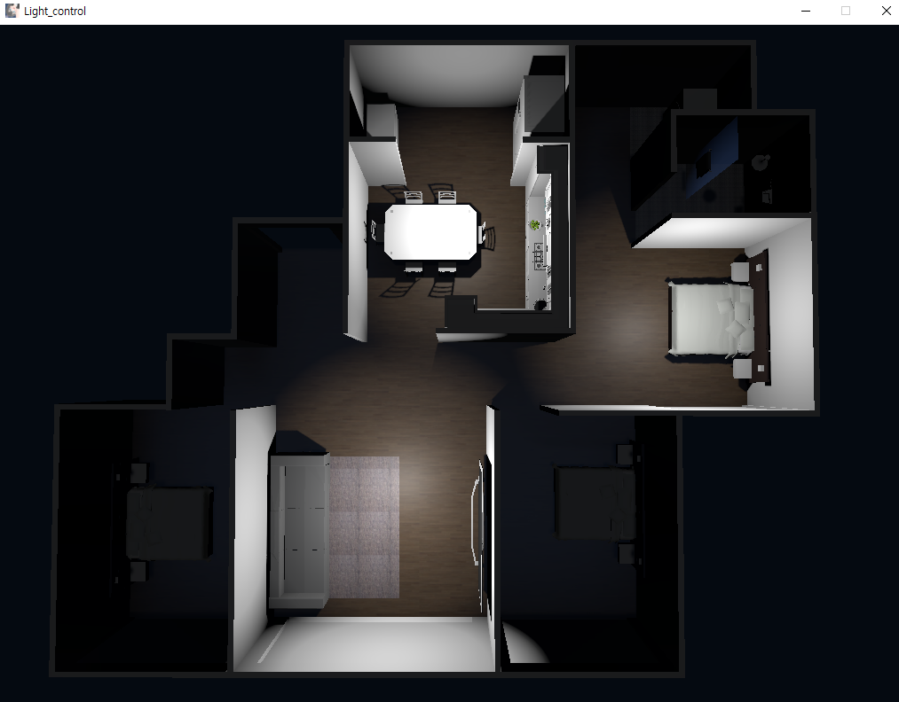

구글 GCP와 Snips NLU, Unity 엔진을 이용한 조명 조작 데모
=========================================================



***

# 1. 참고 논문

* Snips Voice Platform: an embedded Spoken Language Understanding system for private-by-design voice interfaces
* https://arxiv.org/pdf/1805.10190v3.pdf

***

# 2. 실행환경

* Google GCP 계정 필요, 본인 인증하는 json파일 필요, Unity엔진 필요
* (https://cloud.google.com/speech-to-text/docs/quickstart-client-libraries?hl=ko) 참조하여 계정 생성 및 계정 인증 json파일 필요

* Light_control_Unity 폴더 안에 exe 실행파일을 실행해줍니다
 
* 필요요소들을 깔아줍니다

```
    pip install pyaudio snips_nlu pyautogui
```

***

# 3. 동작 설명

```
    python transcribe_streaming_mic.py
```

* 먼저 본인 인증하는 json 파일을 구글이 읽어가고 Snips NLU에 트레이닝셋 파일인 lights_dataset_train_ko.json 파일을 넣어줍니다.   

* 입력된 음성은 구글 서버를 지나 Text 형태로 콘솔창에 찍히게 되고 Snips NLU가 문장을 해석해서 의도와 목적 방에 맞게 키보드를 눌러줍니다.   

* Light_controller.cs가 키보드 입력을 인식하여 방에 불을 키거나 끕니다.    

***

***
Deep Speech와 Snips NLU, Unity 엔진을 이용한 조명 조작 데모
=========================================================

# 1. 참고 논문

* Deep Speech: Scaling up end-to-end speech recognition
* https://arxiv.org/pdf/1412.5567v2.pdf

***
# 2. 실행환경

* deepspeech 엔진 설치 필요, Snips NLU 설치 필요, Unity 엔진 필요

* Light_control_Unity 폴더 안에 exe 실행파일을 실행해줍니다
 
```
    pip install -r requirements.txt
```
***

# 3. 동작 설명

```
    python mic_vad_streaming.py
```
* Deep Speech 엔진이 음성을 텍스트로 바꾸고 Snips NLU가 문장을 해석해서 의도와 목적 방에 맞게 키보드를 눌러줍니다.     

* Light_controller.cs가 키보드 입력을 인식하여 방에 불을 키거나 끕니다. 
